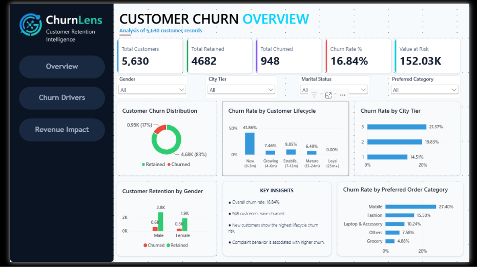
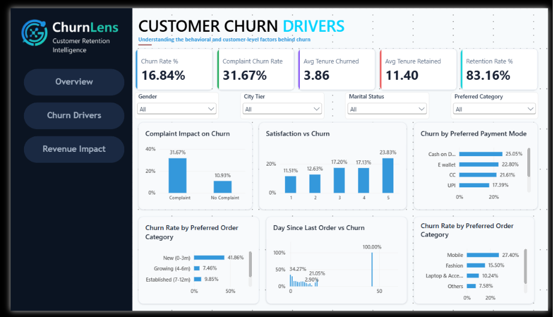
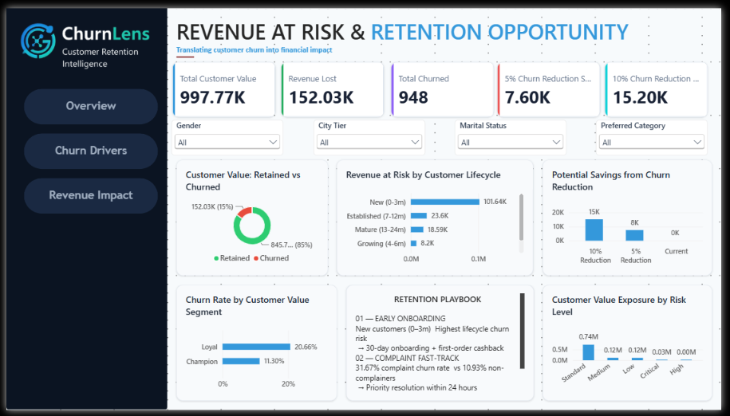

# 🛡️ ChurnLens — Customer Churn & Retention Analytics

> **Turning customer behavior into retention and revenue-at-risk decisions.**

<p align="center">

**📊 Customer Analytics** &nbsp;•&nbsp;
**🎯 Churn Intelligence** &nbsp;•&nbsp;
**💰 Value-at-Risk** &nbsp;•&nbsp;
**💡 Retention Strategy**

</p>

---

## 📌 Project Overview

Customer churn is not only about how many customers leave — it is about
**where churn is concentrated, which customer signals are associated with
it, and where retention efforts should be prioritized.**

**ChurnLens** analyzes **5,630 e-commerce customer records** to identify
customer lifecycle risk, behavioral and experience signals, customer-value
exposure, and practical retention opportunities.

The project follows the journey:

**Data → Analysis → Risk → Value → Action**

---

## 📊 Executive Dashboard

### Customer Churn Overview



Executive view of customer base, churn distribution, lifecycle risk,
customer segments and key retention indicators.

### Customer Churn Drivers



Deep-dive into customer experience, complaints, satisfaction, payment
behavior, order preferences and other observed churn signals.

### Revenue at Risk & Retention Opportunity



Connects customer churn with customer-value exposure and retention
prioritization.

### 🚀 Interactive Dashboard

**[📊 View ChurnLens Power BI Dashboard](YOUR_POWER_BI_PUBLIC_LINK)**

> Replace `YOUR_POWER_BI_PUBLIC_LINK` with the published Power BI report
> URL.

---

## 📈 Key Business Metrics

| Metric | Result |
|---|---:|
| 👥 Customers Analyzed | **5,630** |
| 🔴 Churned Customers | **948** |
| 📉 Churn Rate | **16.84%** |
| 🟢 Retention Rate | **83.16%** |
| 💰 Value Associated with Churn | **₹152.03K** |
| 📢 Complaint Churn Rate | **31.67%** |

---

## 🔎 Key Insights

### 👶 Early Lifecycle Is the Highest-Risk Window

Customers in the **0–3 month** lifecycle stage show a **41.86% churn
rate**, with **653 of 948 churned customers** coming from this group.

**Business implication:** onboarding and early customer engagement should be
the primary retention focus.

### 📢 Complaints Are a Strong Retention Signal

Customers with complaints show **31.67% observed churn** compared with
**10.93%** among customers without complaints — approximately **2.9×
higher**.

**Business implication:** complaint handling can be treated as an
important service-recovery and retention opportunity.

### 💰 Churn Creates Measurable Customer-Value Exposure

**₹152.03K**, or **15.24%** of the total customer-value proxy, is associated
with churned customers.

> `CashbackAmount` is used as a customer-value proxy and should not be
> interpreted as actual company revenue.

### 🎯 Risk Should Be Viewed Alongside Customer Value

Churn varies across customer-value segments, with observed churn declining
from **25.07% in the lowest value quartile** to **10.95% in the highest
value quartile**.

This supports a **risk + value** approach to retention prioritization.

---

## 🎯 Retention Priorities

| Priority | Focus Area | Recommended Action |
|---|---|---|
| **P1** | New customers | Strengthen first 30–90 day onboarding |
| **P2** | Customers with complaints | Faster resolution + structured follow-up |
| **P3** | High-risk customer segments | Prioritize targeted retention actions |
| **P4** | Growing / mid-tenure customers | Prevent migration into higher-risk stages |

### Retention Playbook

**01 — Early Onboarding**  
Improve first-order engagement and early lifecycle support.

**02 — Complaint Fast-Track**  
Identify complaint-related risk and introduce priority service recovery.

**03 — Loyalty & Milestone Engagement**  
Use milestone-based engagement to strengthen mid-tenure retention.

---

## 🔬 Analytical Scope

The analysis covers:

- 👥 Customer demographics
- 👶 Customer lifecycle & tenure
- 📢 Complaint behavior
- ⭐ Satisfaction
- 💳 Payment preferences
- 🛒 Order-category preferences
- 📱 Login behavior
- 🏙️ City tier
- 💰 Customer value
- 🎯 Customer risk & RFM segmentation
- 📉 Churn & retention patterns

---

## 🧠 Analytical Workflow

```text
Raw Customer Data
        ↓
Data Quality & Preparation
        ↓
Exploratory Analysis
        ↓
Business Analysis
        ↓
Customer Segmentation
        ↓
Churn & Value Assessment
        ↓
Interactive Dashboard
        ↓
Retention Recommendations
```

---

## 🛠️ Technology Stack

| Area | Tools |
|---|---|
| Data Analysis | Python, Pandas, NumPy |
| Visualization | Matplotlib, Seaborn |
| Database & Analysis | MySQL, SQL |
| Business Intelligence | Power BI, Power Query, DAX |
| Development | Jupyter Notebook |
| Version Control | Git, GitHub |

---

## 🗄️ SQL Analysis

The SQL layer contains structured business analysis covering:

- Churn measurement
- Customer segmentation
- Lifecycle analysis
- Complaint analysis
- Customer-value ranking
- Risk segmentation
- Executive KPIs

Advanced SQL concepts include:

`CTEs` • `CASE WHEN` • `JOINs` • `Window Functions` • `RANK`
• `NTILE` • `LAG` • Conditional Aggregation

---

## 📊 Dashboard Structure

### Page 1 — Customer Churn Overview

Provides the executive view of:

- Customer base
- Churn & retention
- Lifecycle risk
- City-tier differences
- Customer preferences
- Key business insights

### Page 2 — Customer Churn Drivers

Explores:

- Complaint behavior
- Satisfaction
- Payment preferences
- Order categories
- Customer activity
- Other behavioral signals

### Page 3 — Revenue at Risk & Retention Opportunity

Focuses on:

- Customer-value exposure
- Risk segments
- Lifecycle value at risk
- Retention opportunity
- Recommended actions

---

## 📑 Project Deliverables

The repository contains the complete project workflow along with:

- 📓 Analytical notebooks
- 🗄️ SQL scripts
- 📊 Power BI dashboard
- 🖼️ Analytical visualizations
- 📄 Detailed analytics report
- 📑 Executive presentation

### 📄 Analytics Report

The detailed report documents the complete analysis, including methodology,
data quality, churn drivers, segmentation, value-at-risk, retention
strategy and analytical limitations.

📁 `reports/reports/`

### 📑 Executive Presentation

The presentation summarizes the project as a management-focused business
story covering:

**Problem → Evidence → Risk → Value → Action**

📁 `reports/presentations/`

---

## 📂 Project Structure

```text
ecommerce-customer-churn-retention-analytics/
│
├── 📁 data/
│
├── 📁 notebooks/
│
├── 📁 sql/
│   ├── 01_database_setup.sql
│   ├── 02_data_cleaning.sql
│   ├── 03_business_queries.sql
│   └── 📁 screenshots/
│
├── 📁 powerbi/
│   ├── ChurnLens_Customer_Retention_Analytics.pbix
│   ├── ChurnLens_Theme.json
│   └── 📁 Screenshots/
│       ├── 1.png
│       ├── 2.png
│       └── 3.png
│
├── 📁 reports/
│   ├── 📁 images/
│   ├── 📁 presentations/
│   │   └── ChurnLens_Customer_Churn_Retention_Presentation.pptx
│   └── 📁 reports/
│       ├── ChurnLens_Customer_Churn_Retention_Analytics_Report.pdf
│       └── ChurnLens_Customer_Churn_Retention_Analytics_Report.docx
│
├── 📁 docs/
│
├── 📄 README.md
└── 📄 LICENSE
```

---

## 💡 Business Outcome

The analysis points to three primary retention opportunities:

**Prevent early churn**  
→ Focus on the first 3 months of the customer lifecycle.

**Resolve complaints faster**  
→ Use complaint activity as a retention-risk signal.

**Protect high-risk customer value**  
→ Combine customer risk with value when prioritizing retention efforts.

---

## ⚠️ Analytical Guardrails

- `CashbackAmount` represents a **customer-value proxy**, not actual
  company revenue.
- Findings represent **observed associations**, not causal relationships.
- No predictive churn model was built in this project.
- Satisfaction showed a non-monotonic relationship with churn and should
  be interpreted carefully.
- Scenario values represent potential protected value, not guaranteed
  financial outcomes.

---

## 👨‍💻 Project

**ChurnLens — Customer Retention Intelligence**

An end-to-end Data Analytics portfolio project demonstrating how customer
data can be transformed into **business-focused churn intelligence,
customer-value exposure and retention decisions.**

### 🔗 Connect

**GitHub:**  
https://github.com/AmitKumarJha-ds

**LinkedIn:**  
https://linkedin.com/in/amitkumarjha7777

---

⭐ **Explore the dashboards, analysis, report and presentation in the
repository.**
